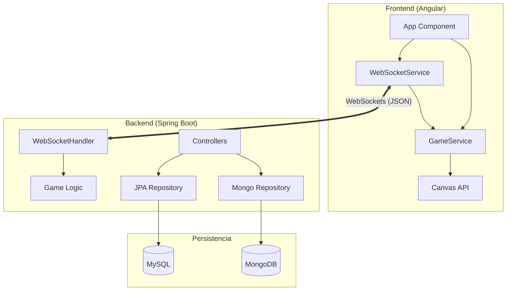

# 🛡️ Guía Técnica: Continentes en Guerra (Missile Defense)

Bienvenido a la documentación técnica oficial del proyecto. Esta guía detalla la arquitectura, el flujo de datos y la lógica interna que hace funcionar este ecosistema multijugador táctico.

---

## 🏗️ 1. Arquitectura del Sistema

El proyecto sigue un modelo **Cliente-Servidor** con comunicación bidireccional en tiempo real.



---

## ⚙️ 2. Tecnologías Core

### Backend (Java 21 + Spring Boot)
- **Spring WebSocket**: Motor de comunicación para la partida.
- **Spring Data JPA (MySQL)**: Gestión de usuarios, inventario, niveles y créditos.
- **Spring Data MongoDB**: Almacenamiento de historial de partidas y analíticas de rendimiento.
- **Jackson**: Serialización/deserialización ultra-rápida de mensajes JSON.

### Frontend (Angular 18+)
- **Canvas API**: Renderizado procedural de alto rendimiento (60 FPS).
- **RxJS**: Gestión de flujos de datos asíncronos y eventos de WebSocket.
- **TypeScript**: Tipado estricto para modelos de juego (Missile, City, Explosion).

---

## 🎮 3. Lógica del Juego (Multiplayer Engine)

### El Ciclo de Vida de una Partida
1.  **Handshake**: El cliente se conecta y el `GameWebSocketHandler` registra la sesión.
2.  **Room Management**: Se crean salas con IDs únicos de 6 dígitos. Si un jugador sale durante la partida, el servidor lo marca como `isBot = true` para no interrumpir el flujo.
3.  **Sincronización de Turnos**: El servidor valida quién tiene el turno. Cada 4 turnos, el servidor ejecuta la **Ruleta de Habilidades**, asignando poderes aleatorios a todos los jugadores.
4.  **Impactos y Validación**: Cuando un misil colisiona, el cliente calcula el daño basándose en las **Facciones** (ej: la Legión Roja hace +50% de daño pero tiene -20% de vida).

### El Sistema de Facciones
Existen 8 facciones únicas definidas en `GameService.ts`. La lógica de daño es dinámica:
```typescript
// Ejemplo de cálculo de daño en applyDamage()
let damage = isNuclear ? 100 : 50;
if (attackerCity.factionId === 0) damage *= 1.5; // Legión Roja
if (city.factionId === 2) city.ammo -= 5;        // Banco Oro (pierde munición al ser golpeado)
```

---

## 🚀 4. Arquitectura de WebSockets (Deep Dive)

La comunicación en tiempo real es el corazón del multijugador. Se basa en un servidor de WebSockets centralizado en Spring Boot (`GameWebSocketHandler.java`).

### El Protocolo de Mensajes
Todos los mensajes intercambiados son objetos JSON con una estructura estricta:
```json
{
  "type": "NOMBRE_DEL_EVENTO",
  "data": { ... campos específicos ... }
}
```

### Gestión de Salas (Rooms)
El servidor mantiene el estado global en memoria usando colecciones concurrentes:
- `sessions`: Mapa de IDs de sesión a objetos `WebSocketSession`.
- `rooms`: Mapa de `roomId` (6 dígitos) a objetos `Room`.
- `playerRooms`: Mapa inverso para encontrar rápidamente en qué sala está un jugador cuando se desconecta.

### Ciclo de Sincronización
1.  **Creación/Unión**: Al unirse, el servidor asigna un `cityId` único al jugador (0 a 3).
2.  **Validación de Turnos**: El servidor es la "autoridad de la verdad". Los clientes proponen acciones (`launch-missile`), pero el servidor las valida y las difunde (**broadcast**) a los demás.
3.  **Sincronización de Impactos**: Para evitar discrepancias, los impactos se notifican al servidor, quien decide si el golpe es válido y actualiza el estado de la sala.

### Resiliencia: El Sistema de Bots
Si el socket de un jugador se cierra (por fallo de red o cierre de pestaña), el servidor activa la lógica de **Conversión a Bot**:
- Cambia la propiedad `isBot` a `true` en el objeto `Player`.
- El juego continúa para los demás. El motor de juego en el frontend de los demás jugadores detecta el flag `isBot` y comienza a simular los movimientos de ese jugador localmente o bajo órdenes del servidor.

### Principales Eventos (Payloads)
| Evento | Dirección | Propósito |
| :--- | :--- | :--- |
| `create-room` | C -> S | Crea una sala privada o pública. |
| `join-room` | C -> S | Intenta entrar en una sala por código. |
| `launch-missile` | C -> S -> C | Sincroniza el disparo de un misil (x, y). |
| `advance-turn` | C -> S -> C | Cambia el turno al siguiente `cityId`. |
| `skill-roulette` | S -> C | Evento global: asigna habilidades aleatorias. |
| `player-became-bot` | S -> C | Notifica que un jugador ha pasado a modo automático. |

---

## 📊 5. Estrategia de Persistencia Dual

El proyecto utiliza dos bases de datos para optimizar diferentes tipos de carga:

1.  **MySQL (Relacional)**:
    -   **Uso**: Datos críticos y consistentes.
    -   **Tablas**: `users` (credenciales, créditos, niveles de mejora).
    -   **Por qué**: Necesitamos transacciones ACID para las compras en la tienda.

2.  **MongoDB (No-SQL)**:
    -   **Uso**: Big Data y Analíticas.
    -   **Colecciones**: `partidas` (logs detallados de cada encuentro).
    -   **Por qué**: Las estadísticas de partidas generan muchos datos (quién atacó a quién, duración, ganadores). MongoDB permite guardar estos documentos JSON complejos sin esquemas rígidos.

---

## 🛡️ 6. Resiliencia y Seguridad

-   **Reconexión Automática**: El `WebSocketService` implementa un algoritmo de *Exponential Backoff* para intentar reconectar si el Wi-Fi falla.
-   **JWT (JSON Web Tokens)**: La comunicación REST para login/registro está protegida.
-   **Seeder Automático**: Al iniciar el backend, `DatabaseSeeder.java` comprueba si existen usuarios y crea perfiles de prueba (`hugo`, `ian`, `gabi`) si la base de datos está vacía.

---

## 🛠️ 7. Mantenimiento y Extensión

Para añadir una nueva **Habilidad**:
1.  Añadir el nombre en `SKILLS` dentro de `game.service.ts`.
2.  Implementar el efecto visual/lógico en el método `applySkill` del mismo servicio.
3.  Asegurarse de que el `GameWebSocketHandler.java` incluya el nuevo índice en el generador aleatorio de la ruleta.

---

> **Nota**: Esta arquitectura permite escalar a cientos de jugadores simultáneos gracias al manejo no bloqueante de WebSockets en Spring Boot.
